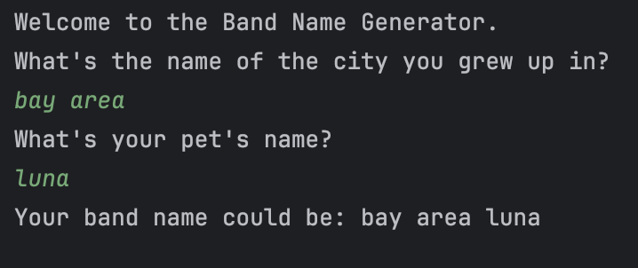

# Band Name Generator 🎸

This is a simple Python program that generates a band name based on user input.

---

## 🧠 How It Works

The program:
1. Welcomes the user
2. Asks for the name of the city they grew up in
3. Asks for their pet’s name
4. Combines both inputs to generate a potential band name

---

## What I Learned

1. How to display messages with print()

2. How to get user input with input()

3. How to combine strings to create dynamic output

4. Understanding basic program flow (step-by-step execution)

---

## 🧪 Example Output

