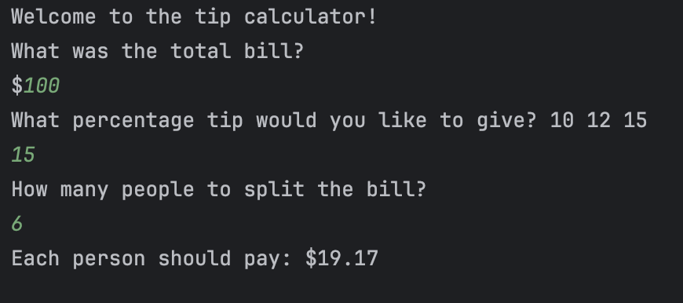

# Day 2: Tip Calculator 💰

A beginner-friendly Python project that calculates how much each person should pay when splitting a bill, including a tip.

---

## 🧠 How It Works

1. Welcomes the user  
2. Asks for the total bill amount  
3. Asks for the desired tip percentage (10, 12, 15)  
4. Asks how many people will split the bill  
5. Calculates the total bill including tip  
6. Divides the total by the number of people  
7. Displays how much each person should pay, rounded to 2 decimal places  

---

## 📝 What I Learned

    1. How to display messages using print()
    2. How to get user input with input()
    3. Converting user input to numeric types with int() and float()
    4. Performing basic arithmetic in Python (+, *, /)
    5. How to calculate percentages in code
    6. How to round numbers to 2 decimal places using round()
    7. How to format output neatly with f-strings
    8. Understanding step-by-step program flow

---

## 📸 Screenshot



---

## ▶️ How to Run

Make sure Python 3 is installed. Then run:

```bash
python3 main.py